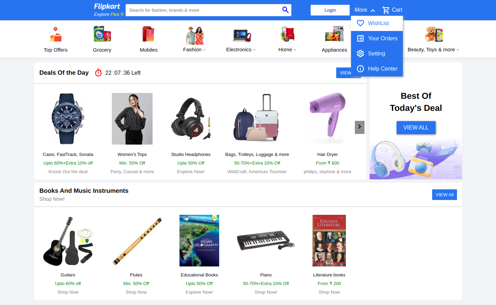

# HTML-CSS-Practical

This project is about responsive Web-Page of Flipkart Home page built in HTML,CSS and JS.

Deploy Link:

https://honey0908.github.io/HTML-CSS-Practical/


### Folder Structure

- Assets Folder consists of CSS folder and Images. There are different CSS files for different components like Navbar, main-container, categories section and for utility classes. Images folder has all the images used in this web page.
- Snaps Folder consists of snapshots of different views such as laptop,tablet,mobile.
- Index.js file is used for scriptting part of carousel feature of product Items.

```sh
├── assets
│   ├── css
│   │   ├── categories.css
│   │   ├── main-container.css
│   │   ├── navbar.css
│   │   └── universal.css
│   └── images
│       ├── categories
│       │   ├── appliances.png
│       │   ├── Beauty__Toys_and_more.png
│       │   ├── electronics.png
│       │   ├── fashion.png
│       │   ├── grocery.png
│       │   ├── Home.png
│       │   ├── Mobiles.png
│       │   ├── Top_Offers.png
│       │   └── travel.png
│       ├── main-container
│       │   ├── Aside-deals.jpg
│       │   ├── bags.jpg
│       │   ├── book-1.jpg
│       │   ├── book-4.jpg
│       │   ├── dryer.jpg
│       │   ├── Educational books.jpg
│       │   ├── flutes.jpg
│       │   ├── guitar.jpg
│       │   ├── harmonium.jpg
│       │   ├── headphones.jpg
│       │   ├── instrument-1.jpg
│       │   ├── jackets.jpg
│       │   ├── Literature-book.jpg
│       │   ├── phone-case.jpg
│       │   ├── Piano.jpg
│       │   ├── printer.jpg
│       │   ├── specs.jpg
│       │   ├── watches.jpg
│       │   └── women-tops.jpg
│       └── navbar
│           ├── flipkart logo.png
│           └── Plus icon.png
├── index.html
├── index.js
├── README.md
└── snaps
    ├── laptop-view.png
    ├── mobile-view.png
    └── tablet-view.png
```

Here are some views of web page.

- Laptop View



- Tablet-View


- Mobile-view

